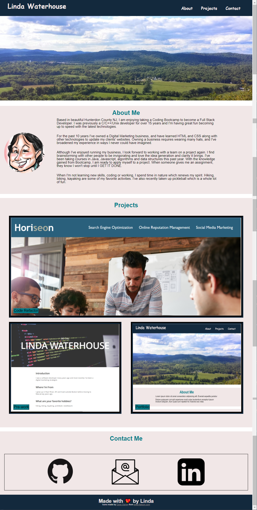
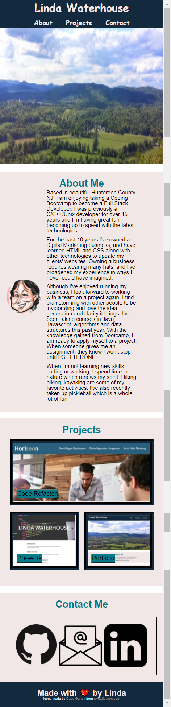

# Portfolio-LindaLW

In Homework #2, we were asked to:

* create a responsive professional portfolio that will showcase our work

* use the skills we learned in flexbox, media queries and CSS variables to make the page responsive

* share some information about ourselves and share our contact info

## Author
- [@LindaWaterhouse](https://www.github.com/llwaterhouse)

## Description

* I used CSS variables for the colors to make it easy to change colors throughout the documnet.

* I used semantic HTML tags to make it obvious where sections were on the page

* I used flexbox to make the page responsive

* I also used media queries to make other areas of the page responsive.

## Built With

* HTML
* CSS
* Flexbox

## Prerequisites

If you want to edit this web page you must have a Github account, and have also downloaded Visual Studio Code.

[Create a Github account](https://github.com)

[Download Visual Studio](https://code.visualstudio.com/download/)

## Deliverables

### Screenshots

Below is screenshot of my portfolio page as it would look on a desktop

Below is a screenshot of my portfolio page as it would look on a mobile device.

### Repository

[GitHub repository for this project](https://github.com/llwaterhouse/Portfolio-LindaLW)

### Deployed Application

[The deployed GitPage Application](https://llwaterhouse.github.io/Portfolio-Project-LindaLW/)

## Acknowledgements

Rutgers Coding Bootcamp

---

© 2021 Linda Waterhouse Consulting. Confidential and Proprietary. All Rights Reserved.

Permission is hereby granted, free of charge, to any person obtaining a copy of this software and associated documentation files (the "Software"), to deal in the Software without restriction, including without limitation the rights to use, copy, modify, merge, publish, distribute, sublicense, and/or sell copies of the Software, and to permit persons to whom the Software is furnished to do so, subject to the following conditions:

The above copyright notice and this permission notice shall be included in all copies or substantial portions of the Software.

THE SOFTWARE IS PROVIDED "AS IS", WITHOUT WARRANTY OF ANY KIND, EXPRESS OR IMPLIED, INCLUDING BUT NOT LIMITED TO THE WARRANTIES OF MERCHANTABILITY, FITNESS FOR A PARTICULAR PURPOSE AND NONINFRINGEMENT. IN NO EVENT SHALL THE AUTHORS OR COPYRIGHT HOLDERS BE LIABLE FOR ANY CLAIM, DAMAGES OR OTHER LIABILITY, WHETHER IN AN ACTION OF CONTRACT, TORT OR OTHERWISE, ARISING FROM, OUT OF OR IN CONNECTION WITH THE SOFTWARE OR THE USE OR OTHER DEALINGS IN THE SOFTWARE.

